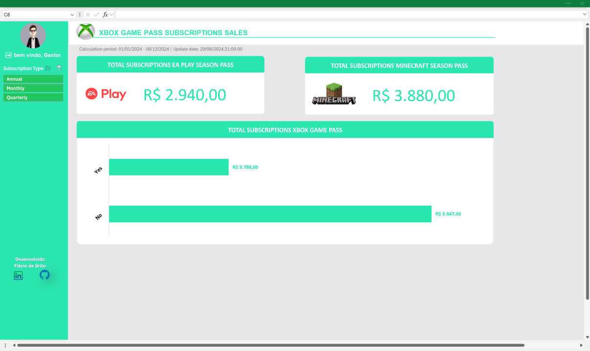
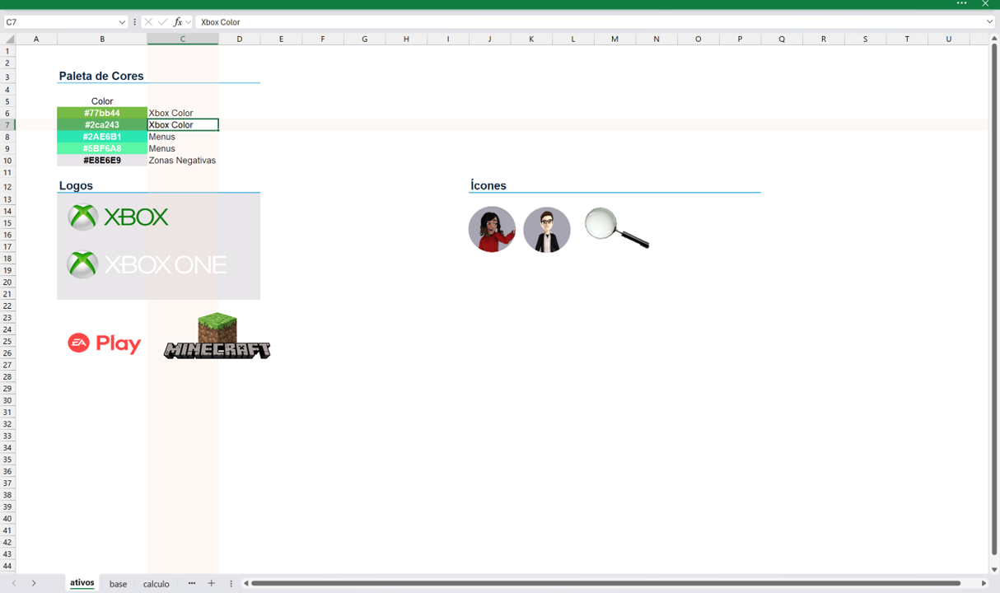
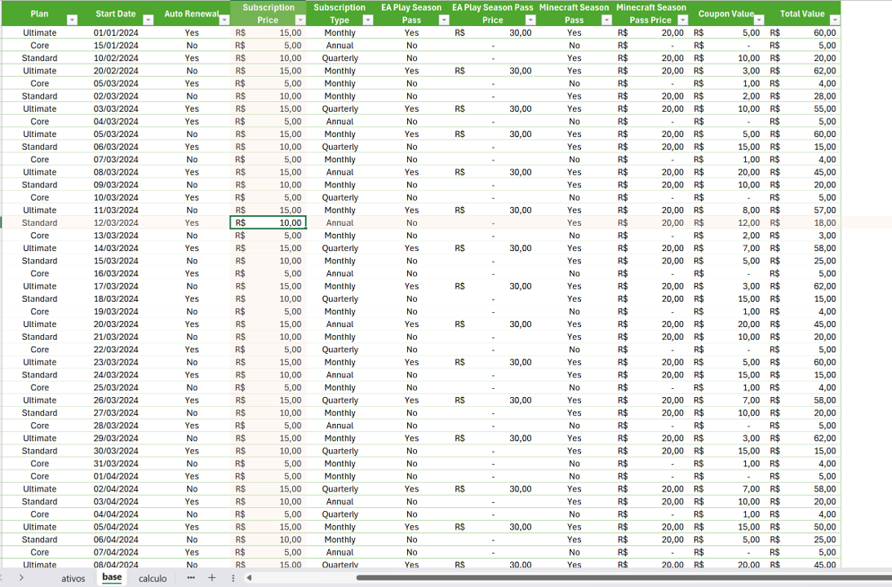
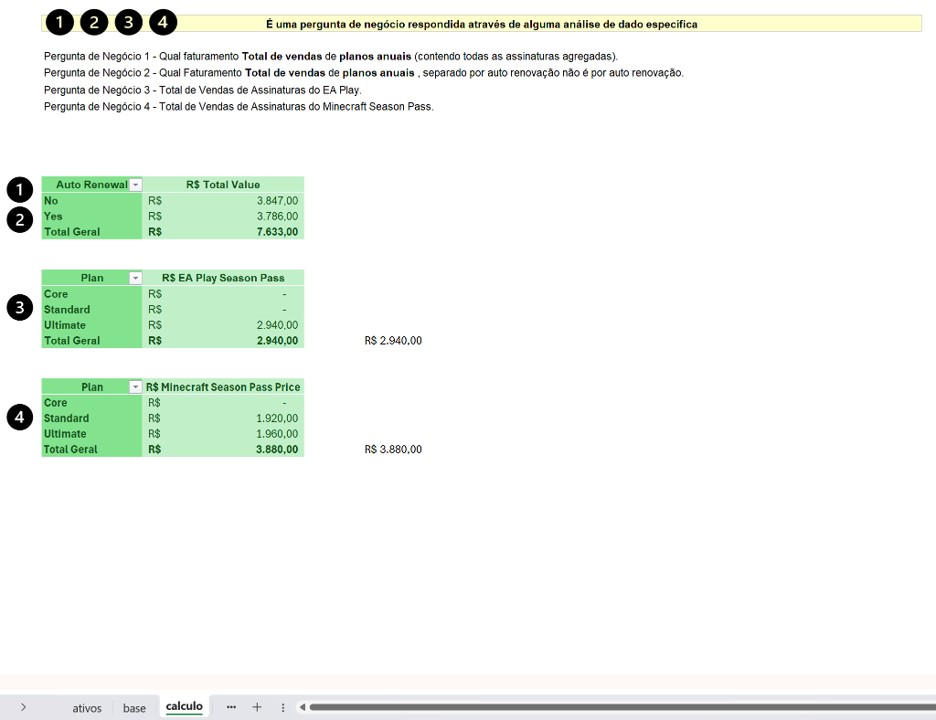
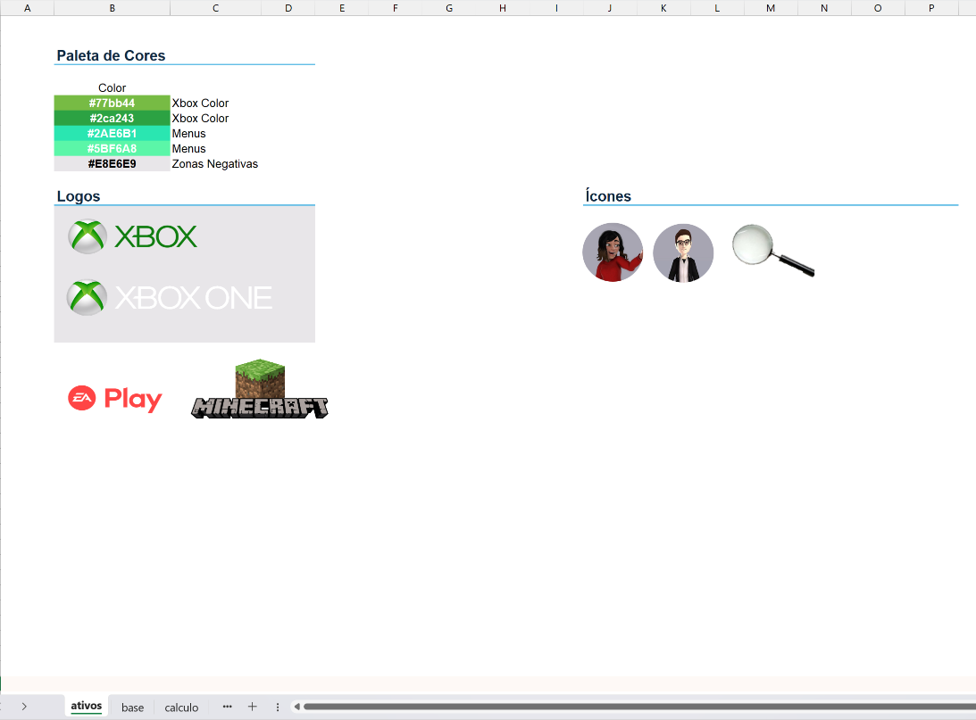

# Xbox Game Pass - Painel de Análise de Vendas

## Visão Geral do Projeto

Este projeto consiste na criação de um painel de vendas dinâmico e interativo no Microsoft Excel para analisar dados de assinaturas do **Xbox Game Pass**. Desenvolvido por **Flávio de Brito**, o painel aplica conceitos de organização, design e visualização de dados para transformar uma base de dados bruta em um dashboard profissional e de fácil interpretação.

O design foi planejado para ser imersivo, ocultando elementos padrão do Excel e utilizando uma paleta de cores e identidade visual consistentes, resultando em uma ferramenta de análise que é tanto funcional quanto esteticamente agradável.

-----

## Índice

  - [Visão Geral do Projeto](https://www.google.com/search?q=%23vis%C3%A3o-geral-do-projeto)
  - [Funcionalidades Principais](https://www.google.com/search?q=%23funcionalidades-principais)
  - [Como Utilizar](https://www.google.com/search?q=%23como-utilizar)
  - [Estrutura do Arquivo](https://www.google.com/search?q=%23estrutura-do-arquivo)
  - [Conceitos Técnicos Aplicados](https://www.google.com/search?q=%23conceitos-t%C3%A9cnicos-aplicados)
  - [Visualização do Dashboard](https://www.google.com/search?q=%23visualiza%C3%A7%C3%A3o-do-dashboard)
  - [Ativos Visuais Utilizados](https://www.google.com/search?q=%23ativos-visuais-utilizados)
  - [Créditos](https://www.google.com/search?q=%23cr%C3%A9ditos)

-----

## Funcionalidades Principais

### Interface Intuitiva e Profissional

A interface foi projetada para ser limpa e direta, com navegação facilitada por um menu lateral (segmentação de dados) que controla todos os elementos visuais do painel.

### Dashboard Interativo

O uso de segmentação de dados permite que o usuário final filtre as informações por tipo de assinatura (Anual, Mensal, Trimestral), e todos os gráficos e indicadores são atualizados automaticamente.

### Indicadores de Performance (KPIs)

O painel destaca "Big Numbers" ou números principais, como o faturamento total das assinaturas **EA Play Season Pass** e **Minecraft Season Pass**, permitindo uma leitura rápida dos principais indicadores.

### Hierarquia Visual

O layout utiliza o conceito de "zona negativa", um fundo com cor neutra que não chama a atenção, para destacar os gráficos e indicadores, guiando o foco do usuário para as informações mais importantes.

### Informações Contextuais

Para que o painel seja autossuficiente, foram adicionados detalhes cruciais como o período de coleta dos dados e a data da última atualização, respondendo a perguntas antes mesmo que elas sejam feitas.

### Organização Metodológica

O projeto é dividido em abas distintas para **Ativos** (imagens e cores), **Base** (dados brutos), **Cálculos** (tabelas dinâmicas) e **Dashboard** (visualização), garantindo organização e fácil manutenção.

-----

## Como Utilizar

### 1\. Navegação Principal

Utilize o menu **"Subscription Type"** à esquerda para filtrar os dados do painel. Ao selecionar uma opção (Anual, Mensal ou Trimestral), todos os gráficos e indicadores serão atualizados para refletir o período escolhido.

### 2\. Análise dos Indicadores (KPIs)

No topo do painel, visualize rapidamente o faturamento total consolidado para as assinaturas adicionais **EA Play Season Pass** e **Minecraft Season Pass**.

### 3\. Gráfico de Vendas

O gráfico de barras central exibe o faturamento total das assinaturas do Xbox Game Pass, segmentado entre renovação automática ("Yes") e não renovação ("No").

### 4\. Validação dos Dados

No cabeçalho, abaixo do título, verifique o período ao qual os dados se referem e a data e hora da última atualização para garantir que você está analisando informações vigentes.

-----

## Estrutura do Arquivo

O arquivo Excel foi estruturado de forma organizada para separar as diferentes etapas do projeto, uma boa prática que facilita a manutenção e a escalabilidade do painel.

  - **ativos**: Esta aba centraliza todos os recursos visuais, como logos, ícones e a paleta de cores oficial do projeto, garantindo consistência visual.
  - **base**: Contém os dados brutos de vendas, servindo como a única fonte de verdade para todas as análises.
  - **calculo**: É a camada onde os dados brutos são transformados em informação.Aqui, tabelas dinâmicas são criadas para resumir os dados e responder a perguntas de negócio específicas.
  - **dashboard**: A camada final de visualização, onde os gráficos e indicadores são apresentados de forma clara e interativa para o usuário final. Todas as informações nesta aba são originadas da aba "calculo".

-----

## Conceitos Técnicos Aplicados

  - **Tabelas Dinâmicas**: Utilizadas como motor para agregar e sumarizar os dados brutos, permitindo criar análises complexas de forma rápida e eficiente.
  - **Segmentação de Dados (Slicers)**: Ferramenta visual conectada às tabelas dinâmicas para criar filtros interativos e amigáveis, funcionando como o menu principal do painel.
  - **Fórmulas Vinculadas a Formas**: Os cartões de KPI ("Big Numbers") são criados com formas do Excel, e o texto dentro delas é vinculado dinamicamente a células da aba de cálculos, garantindo que os valores sejam sempre atualizados.
  - **Agrupamento de Objetos**: Múltiplos elementos visuais (ícones, caixas de texto, formas) são agrupados para formar um único componente, como um cartão de KPI, facilitando o alinhamento e o gerenciamento.
  - **Configuração de Propriedades**: Todos os objetos visuais (gráficos, imagens, etc.) são configurados para **"Não mover ou dimensionar com células"**, o que garante a estabilidade do layout independentemente de alterações nas linhas ou colunas da planilha.

-----

## Visualização do Dashboard

\

\
\</p\>
\

\<em\>Visão geral do painel com filtro "Anual" aplicado.\</em\>
\</p\>

\

\
\</p\>
\

\<em\>Visão geral do painel com filtro "Mensal" aplicado.\</em\>
\</p\>

\

\
\</p\>
\

\<em\>Visão geral do painel com filtro "Trimestral" aplicado.\</em\>
\</p\>

\

\
\</p\>
\

\<em\>Exemplo da aba "calculo", onde as análises são preparadas.\</em\>
\</p\>

\

\
\</p\>
\

\<em\>Aba "ativos", a base para a identidade visual do projeto.\</em\>
\</p\>

-----

## Ativos Visuais Utilizados

\

\
\
\
\
\
\</div\>

*Imagens complementares do projeto.*

-----

## Créditos

Este projeto foi desenvolvido e idealizado por **Flávio de Brito**. O conteúdo e a metodologia foram baseados nas aulas e materiais fornecidos pela **Digital Innovation One (DIO)**.